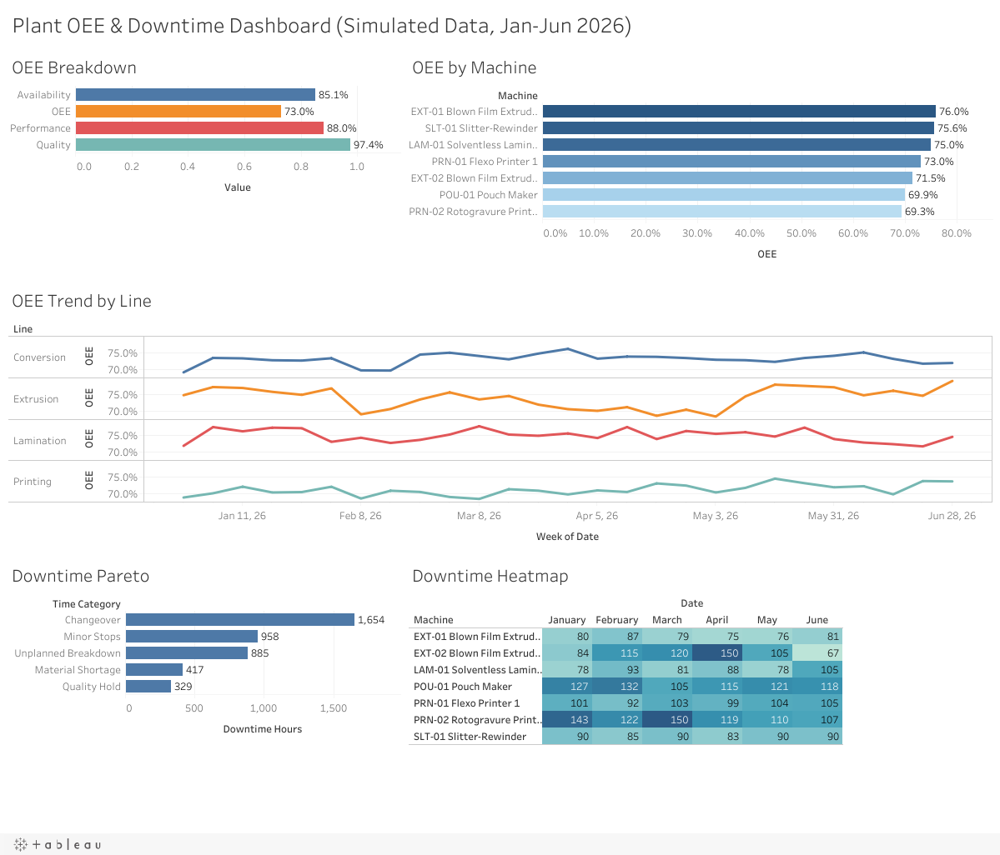

# Manufacturing OEE & Downtime Dashboard (Tableau)

**Live dashboard (Tableau Public):**
https://public.tableau.com/app/profile/aditya.pathak7151/viz/ManufacturingOEEDowntimeDashboard/PlantOEEDowntimeDashboardSimulatedDataJan-Jun2026



An interactive Tableau dashboard that tracks **Overall Equipment Effectiveness (OEE)** and downtime for a
flexible-packaging plant: 7 machines across 4 production lines, 3 shifts, January–June 2026.
Clicking a machine in *OEE by Machine* filters the rest of the dashboard.

> **Data note:** all data is **simulated**. It comes from `generate_data.py`, which I adapted from the
> machine simulator in my Nexus manufacturing-analytics project. No real plant or company data is used.

## Questions the dashboard answers

| View | Question |
|---|---|
| OEE Breakdown | Which OEE component (availability, performance or quality) loses the most? |
| OEE by Machine | Which assets are the weakest? (click one to filter) |
| OEE Trend by Line | How does weekly OEE move per production line, and when did it drop? |
| Downtime Pareto | Which loss categories account for most of the lost hours? |
| Downtime Heatmap | Where and when is downtime concentrated (machine × month)? |

## Key findings

- **Plant OEE is 73.0%** (availability 85.1% × performance 88.0% × quality 97.4%). Availability loss is the biggest lever.
- **Changeovers are the #1 loss**, with 1,654 of 4,243 downtime hours (39%). **PRN-02 Rotogravure** has the lowest OEE (69.3%) because of long changeovers. After the SMED programme started in April, its changeover hours fell **36%** (245 h in Jan–Mar vs 158 h in Apr–Jun).
- **EXT-02 Blown Film Extruder** degrades from March: unplanned breakdowns rise from 23 h (Jan) to 70 h (Apr) and monthly OEE falls to 64.3%. After a planned overhaul on 12 May, breakdowns drop to 10.5 h in June and OEE recovers to 76.2%.
- **A resin-supply delay in February** doubles material-shortage downtime (123 h vs about 59 h in a normal month).
- **LAM-01 Laminator** quality holds triple in June (32 h vs about 10 h per month), consistent with humidity-related adhesive-curing issues.
- **Night shift (C)** runs at 70.4% OEE vs 74.6% for the morning shift, driven by slower speeds and more minor stops.

## Data model

`data/plant_oee_downtime.csv` has 19,644 rows. There is one row per **date × shift × machine × time category**:

| Column | Description |
|---|---|
| Date, Shift, Line, Machine ID, Machine | Dimensions |
| Time Category | `Running`, or a loss reason: `Changeover`, `Minor Stops`, `Unplanned Breakdown`, `Material Shortage`, `Quality Hold` |
| Minutes | Minutes spent in that category (450 planned minutes per shift) |
| Ideal / Total / Good Output (kg), Scrap (kg), Energy (kWh) | Production measures, filled on `Running` rows only |

This long format makes every loss reason a single dimension, so Pareto and heatmap views need no pivoting.

## Tableau calculated fields

```text
Run Minutes      = IF [Time Category] = "Running" THEN [Minutes] END
Downtime Minutes = IF [Time Category] <> "Running" THEN [Minutes] END
Availability     = SUM([Run Minutes]) / SUM([Minutes])
Performance      = SUM([Total Output (kg)]) / SUM([Ideal Output (kg)])
Quality          = SUM([Good Output (kg)]) / SUM([Total Output (kg)])
OEE              = [Availability] * [Performance] * [Quality]
Downtime Hours   = SUM([Downtime Minutes]) / 60
```

OEE is computed from summed components rather than by averaging row-level ratios. This keeps it correct at any
level of aggregation (plant, line, machine, week or shift).

**Tableau techniques used:** aggregate calculated fields, Measure Names/Values, small multiples, a continuous
date axis (week), a heatmap with square marks, sorted bars, custom number formats, a floating dashboard layout
and a dashboard filter action.

## Reproduce the data

```bash
python3 generate_data.py   # writes data/plant_oee_downtime.csv (seeded, deterministic)
```

---
Built by **Aditya Pathak**. Portfolio: https://adityapathakportfolio.vercel.app · LinkedIn: https://www.linkedin.com/in/aditya-pathak-2467292ab/
